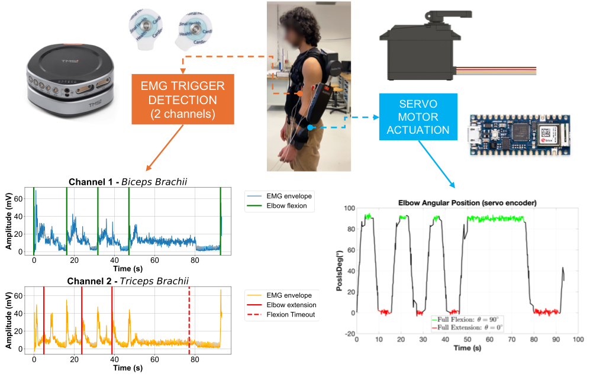

# ASPEN Demo

[](./LICENSE.md)


ASPEN: Assisted-as-needed sEMG-triggered
control of an upper limb exoskeleton for Poststroke
home rEhabilitatioN
Development, verification and validation.

A compact, EMG-driven exoskeleton demo: real‑time streaming, calibration, control, and analysis — with a GUI for smooth operation and Arduino firmware for the exo control loop.

[](docs/media/graphical-abstract.pdf)

Click the image to open the PDF. If it does not load, use the direct link: [`docs/media/graphical-abstract.pdf`](docs/media/graphical-abstract.pdf)

---

## Highlights
- **Real‑time EMG**: stream, record, and process biosignals.
- **One‑click GUI**: run the full demo from a user-friendly interface.
- **Therapist mode**: assisted workflows for clinician-driven sessions.
- **Arduino firmware**: exoskeleton motion/control via `ASPEN_CONTROL.ino`.
- **Offline analysis**: MATLAB tools and sample datasets included.
- **Sample exercises**: ready-to-stream examples for quick testing.

---

## Quick Start
1. Clone this repository.
2. Set up the TMSi virtual environment (`tmsi_venv`) using the commands in the "Setup TMSi" section.
3. Place the files as follows (per the original workflow):
   - Put `ASPEN_GUI.py` inside your `tmsi_venv` folder.
   - Put the remaining Python scripts inside `tmsi-python-interface-V5.3.0.0` (located within `tmsi_venv`).
4. Activate the virtual environment and launch the GUI.

```bash
# macOS/Linux
source tmsi_venv/bin/activate
python ASPEN_GUI.py

# Windows (PowerShell)
# .\tmsi_venv\Scripts\Activate.ps1
# python ASPEN_GUI.py
```

Use the GUI to navigate through calibration, streaming, and control modes.

---

## Repository Structure
```
ASPEN_CONTROL/
│── ASPEN_CALIBRATE.py          # EMG calibration and thresholding
│── ASPEN_CONTROL.ino           # Arduino control logic for the exoskeleton
│── ASPEN_EMPOWER.py            # Real-time EMG-triggered exo movement
│── ASPEN_GUI.py                # Graphical interface to run the demo
│── ASPEN_RECORD.py             # Record EMG signals
│── ASPEN_STOP.py               # Safe stop and return to base position
│── ASPEN_STREAM.py             # Stream pre-recorded EMG data
│── ASPEN_THERAPIST.py          # Therapist-assisted workflow
│── arduino_secrets.h           # WiFi/connection configuration
│
│── STREAM_SAMPLE_EXERCISES/    # Example inputs for streaming
│   │── Calibration_th1.txt
│   │── Exercise_1.poly5
│   │── Exercise_2.poly5
│
│── DATA_ANALYSIS/              # MATLAB analysis tools and example datasets
```

---

## Prerequisites
- A working TMSi setup and drivers.
- Python environment compatible with the TMSi interface used in your lab setup.
- Arduino toolchain (if you plan to compile and upload `ASPEN_CONTROL.ino`).

---

## How To Run
1. Activate `tmsi_venv`.
2. Launch `ASPEN_GUI.py`:

```bash
python ASPEN_GUI.py
```

3. Follow the on-screen steps to calibrate, stream, or empower the exo.

---

## Data Analysis
- MATLAB scripts for analysis live in `ASPEN_CONTROL/DATA_ANALYSIS/`.
- Includes tests, helper functions, and raw example data for reproducible evaluation.

---

## Adding The Graphical Abstract
- Save your image at `docs/media/graphical-abstract.png` (create folders if needed).
- Reference it near the top of this README as:

```markdown

```

---

## Troubleshooting
- **TMSi drivers**: ensure drivers and permissions are correctly installed.
- **Serial/USB access (macOS/Linux)**: verify device permissions and correct port.
- **Virtual environment**: confirm the GUI runs from within `tmsi_venv`.

---

## Citation
If this demo or its analysis tools help your work, please cite the repository:

```
@software{aspen_demo_2025,
  title        = {ASPEN Demo},
  author       = {Simone Sgorbati},
  year         = {2025},
  url          = {https://github.com/simosgorby/ASPEN-DEMO}
}
```

---

## Project Overview
ASPEN is an “assisted‑as‑needed” system for post‑stroke rehabilitation targeting mild upper‑limb motor impairments. It couples the Auxivo EduExo Pro exoskeleton with the TMSi SAGA device to detect muscle activation via surface EMG (sEMG) and translate user intention into elbow motion.

Key points:
- Hardware: Auxivo EduExo Pro (1‑DOF elbow) + TMSi SAGA.
- Signals & control: sEMG from biceps and triceps; binary controller with a double‑threshold intention‑detection algorithm.
- Motion: elbow flexion/extension along predefined trajectories at customizable speed.
- Modes:
  - Empower: real‑time assistance triggered by muscle activation.
  - Stream: passive, repeatable exercises using pre‑recorded EMG.
  - Therapist: manual guidance during therapy sessions.
- Safety: physical emergency stop button; timeout for prolonged flexion.
- Usability: simple, intuitive GUI for setup and operation.

Results (preliminary):
- Intention detection accuracy > 90% with the double‑threshold algorithm.
- Higher repeatability vs therapist‑assisted movements:
  - Exoskeleton: RMSE = 4.53°, IQR = 0.93°
  - Therapist: RMSE = 12.94°, IQR = 6.13°
- Usability: setup < 10 minutes; median SUS score = 62.5/100 (n = 5 participants).

For details and methodology, see the scientific report in `ASPEN_REPORT` (included with the project).

## Setup TMSi
Below are the commands to create the `tmsi_venv` environment and set up the TMSi interface.

macOS/Linux:

```bash
# 1) Create the virtual environment
python3 -m venv tmsi_venv

# 2) Activate
source tmsi_venv/bin/activate

# 3) Upgrade base tooling
pip install --upgrade pip setuptools wheel

# 4) Place the TMSi interface package inside the environment
#    Extract/place the folder 'tmsi-python-interface-V5.3.0.0' inside 'tmsi_venv/'
#    (e.g., tmsi_venv/tmsi-python-interface-V5.3.0.0)

# 5) Install dependencies (if a requirements.txt is present)
pip install -r tmsi-python-interface-V5.3.0.0/requirements.txt || true
```

Windows (PowerShell):

```powershell
# 1) Create the virtual environment
python -m venv tmsi_venv

# 2) Activate
.\tmsi_venv\\Scripts\\Activate.ps1

# 3) Upgrade base tooling
pip install --upgrade pip setuptools wheel

# 4) Place the TMSi interface package inside the environment
#    Extract/place the folder 'tmsi-python-interface-V5.3.0.0' inside 'tmsi_venv\'
#    (e.g., tmsi_venv\tmsi-python-interface-V5.3.0.0)

# 5) Install dependencies (if a requirements.txt is present)
pip install -r tmsi-python-interface-V5.3.0.0\\requirements.txt
```

Notes:
- Ensure TMSi drivers and device permissions are correctly configured on your system.
- Place `ASPEN_GUI.py` inside `tmsi_venv/`, and the other scripts inside `tmsi-python-interface-V5.3.0.0`.
- If the TMSi package is distributed as an archive (zip), extract it before installing requirements.

---

## License
This project is released under the license listed in [`LICENSE.md`](./LICENSE.md).

## Authors
Developed at **Politecnico di Milano**, within the "Collaborative Robotics" course, A.Y. 2024-25.

---

## Acknowledgements
Thanks to Prof. Emilia Ambrosini, Prof. Marta Gandolla and Dr. Luca Pozzi for supervising the project.
